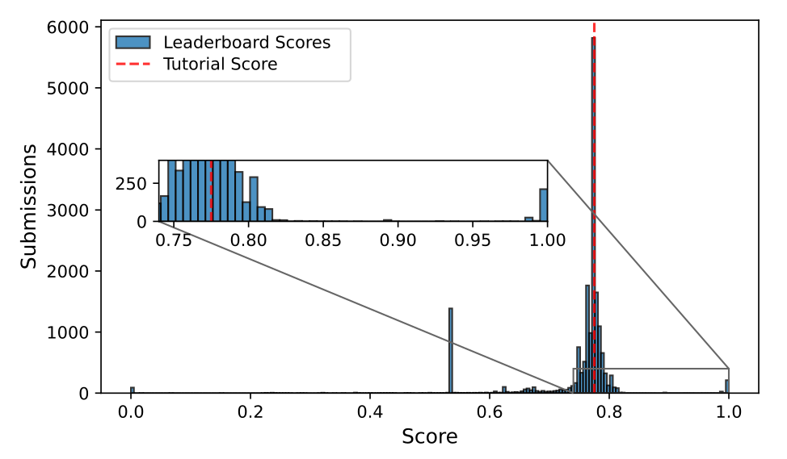

# Titanic: Machine Learning from Disaster

Hi there! Welcome to a **deep study** for the *Titanic - Machine Learning from Disaster* competition, hosted by **Kaggle**. You can find my original competition notebook in this [link](https://www.kaggle.com/code/fertmeneses/titanic-kaggle-full-analysis)👈🏽.

Here, I tell you the story, in simple terms, of how I've used **feature engineering**, **data edition** and **Machine Learning techniques** to train an algorithm that can predict whether a passenger survived the Titanic disaster based on many indicators such as their age, title and the fare they paid.

The progamming code is written in Python language, including well-known libraries like **pandas**, **numpy**, **matplotlib**, **sklearn** and **xgboost**.

## Introduction

The Titanic started its voyage in Southampton (UK) on 10 April 1912, made stops in Cherbourg (France), Queenstown (nowadays Cobh, Ireland) and then sailed to New York (US). Unfortunately, the ship never reached its destination but **sank in the Atlantic ocean on 15 April 1912, after colliding with in iceberg**.

The collision with the iceberg ocurred around 23:40, with most of the passengers already gone to bed, and the evacuation was carried out in a very disorganized way, with unequal treatment of passengers from different classes. **The 20 lifeboats carried by the ship could only accomodate 1,178 people, out of the 2,224 passengers and crew**. The vessel RMS Carpathia arrived about 2 hours after the sinking, rescuing all survivors at that time.

## Machine Learning expectations

What do we expect from the Machine Learning approach in this challenge? Although we have much information available, **predicting whether a passenger survived the Titanic tragedy is not a deterministic problem**. Some passengers had a higher chance of survival than others, for example given their class or gender, but that didn't translate into certainty. Although the Machine Learning algorithm should easily find clear correlations between the dataset features and the survival chance, **the real challenge is to discover "hidden" information, those subtle within the data patterns that escape our human intuition and may improve the predictions**.

By July/2024, the Leaderboard for the Kaggle competition showed the results of 17,700 submissions, evaluated by the predictions' accuracy (from 0 to 1) on the testing dataset. More than half of the submissions scored between 0.75 and 0.80, with **more than 6,000 results between 0.7725 and 0.7775**. As a reference, the competition offers a very basic tutorial with a score of 0.7750. Based on these results, **achieving a score close to 0.80 is already a challenge**. As a curious fact, I will not neglect that some participants reached 1.00 (perfect) accuracy, but that's only because they are using a file with the solution, where all correct predictions can be manually copied and submitted!

## Feature engineering

The Titanic competition includes **two datasets: "train", with 891 entries** and explicit information about the passenger's survival; and **"test", with 418 entries** and missing survival information. Both datasets share the same features (other than "Survived"), although none of them are complete, meaning that they have scattered missing fields.

**Original features:**

- **Survival**: Whether a passenger survived (1) or not (0). [Only in training dataset]
- **Name**: Passenger full name, including their title.
- **Pclass**: Passenger class, either 1st (upper), 2nd or 3rd (lower) class.
- **Sex**: Female or male.
- **Age**: Age in years.
- **Sibsp**: Number of siblings and spouse aboard the Titanic.
- **Parch**: Number of parents and children aboard the Titanic.
- **Ticket**: Ticket number.
- **Fare**: How much the passenger paid for their ticket.
- **Cabin**: Cabin number.  
- **Embarked**: Port of embarkation (Cherbourg, Queenstown or Southampton)

Some features carry straight-forward information, such as Pclass, Sex or Age. Other features, for example Cabin or Name, are less obvious or have encoded information. Below, you will find the **original distribution and survival rates** for the Age and Sex features, as well as a WordCloud for the Cabin feature (listing all unique values). 

In all cases, the missing values were filled according to carefully chosen criteria for each feature. Furthermore, **new features were engineered based on the original information**. For example, I generated the new Title feature from the Name data, which encodes information about the gender (Mr. vs Ms.), age (Master vs Mr., only for males) and marital status (Ms. vs Mrs., only for females). There were other titles such as Dr., Countess or Capt., much less frequent, which I grouped in the "Rare" category.

Another example of feature engineering is the **heavy data edition for the Cabin feature, with 80% missing values!** Normally, such incomplete feature would be dropped, but in this case there is a high correlation between missing Cabin values and low survival rates, probably because the cabin data couldn't be retrieved from the victims. Therefore, I compute the missing values as "X", and additionally group the known values according to the deck level in the ship, named from "A" to "G" in descending order.

After engineering features, **the original set of 10 features** (excluding the survival status) **grew to 36 numeric and One-Hot encoded features**, meaning that they are ready for any Machine Learning algorithm. However, more is not necessary better, so I studied the correlation matrix for the training dataset and selected those features highly correlated with the survival rate.

## Machine Learning results

Building a clean dataset, including feature engineering and selection, was half of the work, the other half was exploring and optimizing Machine Learning algorithms to make good predictions. As the amount of information was limited (the training dataset has less than 900 entries), I used exclusively shallow learning algorithms, designing models with different complexities:

| Designation | Description | Libraries |
| :---: | :---: | :---: |
| Basic | Individual shallow learning algorithms | RandomForestClassifier, LogisticRegression, GradientBoostingClassifier, HistGradientBoostingClassifier, XGBClassifier, KNeighborsClassifier, LinearSVC |
| Ensemble | Horizontal collection of basic models, final output via majority vote | VotingClassifier |
| Stacking | Hierarchical collection of basic models, outputs are concatenated | StackingClassifier |

As a first exploration stage, I trained and evaluated all models using default hyperparameters, and short-listed those that scored higher than 0.78, already better than the average competition performance 0.7725-0.7775. From there, I worked on the hyperparameters optimization, exploring many options for each model. In the following plot, you can see a wide span of 648 results displayed as a function of their training score (vertical axis) and submission score (horizontal axis).

On the right of the plot, many models scored better than the average results, and the best score 0.7990 belonged to a Stacking model with a final LinearSVC layer (S_SVC). Looking for further optimization, I took this S_SVC model and finely tuned its hyperparameters. As a result, I produced many variations of the model with scores above the average, but I couldn't improve the 0.7990 record.

## Conclusions

As I mentioned at the beggining, scoring around 0.8000 is a big challenge, and I'm happy with my 0.7990 score, which I attribute to a careful feature engineering process and exploration of Machine Learning models. I'm sure there is room for improvement, and making a more intensive hyperparameters search would improve the performance above the 0.80 line. However, I think that the real progress would come with the development of new ideas for feature engineering, Machine Learning modeling and new strategies to avoid the overfitting problem during training.

My work stands as an example of a deep study of the *Titanic: Machine Learning for Disaster* competition, with a strong focus on feature engineering and the development of Machine Learning model based on Shallow Learning algorithms with different complexities. The code is fully documented and transparent, guiding the reader step by step and explaining my lines of thought. I invite you to read it and make any comments and suggestions either in the [Kaggle](https://www.kaggle.com/code/fertmeneses/titanic-kaggle-full-analysis) or [Github](https://github.com/Fertmeneses/titanic-ML-from-disaster) versions, any feedback is very welcome!

