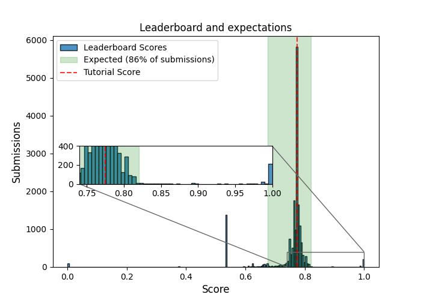

# Titanic: Machine Learning from Disaster

Hi there! Welcome to a **deep study** for the *Titanic - Machine Learning from Disaster* competition, hosted by **Kaggle**. You can find my original competition notebook in this [link](https://www.kaggle.com/code/fertmeneses/titanic-kaggle-full-analysis)👈🏽.

Here, you will find the story, told in simple terms, of how I've used **feature engineering**, **data edition** and **Machine Learning techniques** to train an algorithm that can predict whether a passenger survived the Titanic disaster based on many indicators such as their age, title the fare they paid.

The progamming code is written in Python language, including well-known libraries like **pandas**, **numpy**, **matplotlib**, **sklearn** and **xgboost**.

## Introduction

- - - - - - - - - - - - - - - - - -

[Intro about the Titanic tragedy].

 

- - - - - - - - - - - - - - - - - -

[Machine learning challenge and accuracy expectations]

- - - - - - - - - - - - - - - - - -

[Data analysis: original features]

- - - - - - - - - - - - - - - - - -

[Feature engineering]

- - - - - - - - - - - - - - - - - -

[Machine Learning exploration]

Chart with models:

Simple, Ensemble, Stacking.

Model exploration:

Final optimization:

Xxxx

- - - - - - - - - - - - - - - - - -

[Final comments]

Final submission.

Discussion.