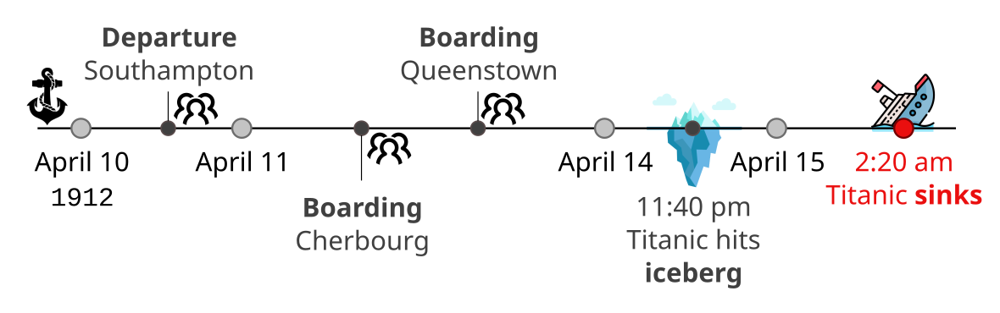
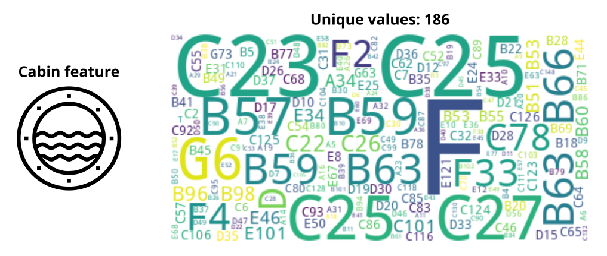
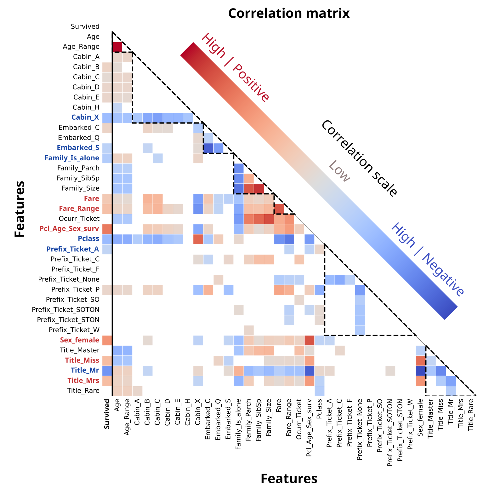
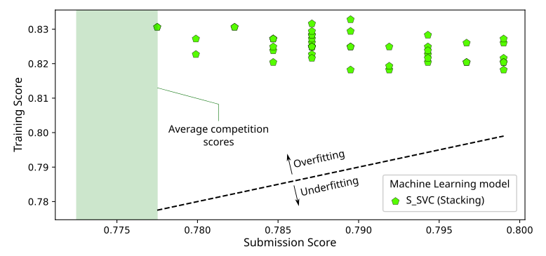

# Titanic: Machine Learning from Disaster

Hi there! Welcome to a **deep study** for the *Titanic - Machine Learning from Disaster* competition, hosted by **Kaggle**. You can find my original competition notebook in this [link](https://www.kaggle.com/code/fertmeneses/titanic-kaggle-full-analysis)👈🏽.

Here, I tell you the story, in simple terms, of how I've used **feature engineering**, **data edition** and **Machine Learning techniques** to train an algorithm that can predict whether a passenger survived the Titanic disaster based on many indicators such as their age, title and the fare they paid.

The progamming code is written in Python language, including well-known libraries like **pandas**, **numpy**, **matplotlib**, **sklearn** and **xgboost**.

## Introduction

The Titanic started its voyage in Southampton (UK) on 10 April 1912, made stops in Cherbourg (France), Queenstown (nowadays Cobh, Ireland) and then sailed to New York (US). Unfortunately, the ship never reached its destination but sank in the Atlantic ocean on 15 April 1912, after colliding with in iceberg.

The collision with the iceberg ocurred around 23:40, with most of the passengers already gone to bed, and the evacuation was carried out in a very disorganized way, with unequal treatment of passengers from different classes. The 20 lifeboats carried by the ship could only accomodate 1,178 people, out of the 2,224 passengers and crew. The vessel RMS Carpathia arrived about 2 hours after the sinking, rescuing all survivors at that time.

## Machine Learning expectations

What do we expect from the Machine Learning approach in this challenge? Although we have much information available, **predicting whether a passenger survived the Titanic tragedy is not a deterministic problem**. Some passengers had a higher chance of survival than others, for example given their class or gender, but that didn't translate into certainty. Although the Machine Learning algorithm should easily find clear correlations between the dataset features and the survival chance, the real challenge is to discover "hidden" information, those subtle within the data patterns that escape our human intuition and may improve the predictions.

By July/2024, the Leaderboard for the Kaggle competition showed the results of 17,700 submissions, evaluated by the predictions' accuracy (from 0 to 1) on the testing dataset. Most of the submissions scored between 0.74 and 0.82

Xxxxx continue from here

[Machine learning challenge and accuracy expectations]

# Introduction: scores, motivation and expectations 

Let's say you build a machine learning (ML) model using a particular set of features to predict which passengers survived the Titanic disaster. You submit your results and get a score of 0.7756... is it a good result? What reference value should you compare it to? Should you aim for 0.9999? I've asked myself all these questions, and over many days, weeks (months?), I became more and more aware of my expectations...

First of all, any result you get is a step forward, it means you are actively working to solve the problem. Second point: a perfect score 1 (or 0.9999) is unrealistic for ML solutions... we're not trying to solve a problem governed by precise laws of Physics, instead we're dealing with a complex situation that involves some degree of uncertainty. That said,  it's still important to establish a reasonable benchmark for the accuracy that we expect. Although I don't have an analytical way to determine that reference score, we can take a look at the statistics available in the public Leaderboard (updated on 20/Jul/2024, 17,700 submissions):

A few observations here:
* The raw data for the scores is represented by the blue bars, showing that scores are concentrated between 0.75 and 0.80. The scoring interval [0.7725, 0.7775] has the most submissions, approximately 6,000! 
* The red vertical line shows the tutorial score 0.7750, in which a simple model with the original features is implemented.
* The shaded green area indicates typical expected scores, with 86% of all submissions, according to the following criteria:
    - For a minimum expectation, consider building a model that always predicts that a passenger does not survive. Because we know that 1502 out of 2224 passengers didn't survive, the average accuracy will be 1502/2224=0.675.
    - For the highest expected score, I've chosen a 0.82 score based on the performance of other Kagglers' notebooks and their comments.

Is it possible to get a perfect score 1? Since the Titanic is a "Getting Started" competition and you can submit your solutions multiple times (with some daily limits), in principle you could explore all possible survival combinations until you get the right one. Or, to save time, you could just use the Solution File! If you look around the Kagglers' comments, you will eventually find the link to the <a href="https://storage.googleapis.com/kaggle-forum-message-attachments/66979/2180/titanic.csv">Solution file</a> .

That explains why there are some so many perfect scores in the Leaderboard... But don't let these unfair results discourage you, the Titanic competition is meant to be a learning experience, and it's up to each one how to spend their time. In fact, this Notebook is going to use the solution file! Not for cheating, but to accelerate research and get immediate feedback on the various features and ML models that I'm going to explore. So when I share my Submission scores, now you know how.

- - - - - - - - - - - - - - - - - -

[Data analysis: original features]

- - - - - - - - - - - - - - - - - -

[Feature engineering]

- - - - - - - - - - - - - - - - - -

[Machine Learning exploration]

Chart with models:

Simple, Ensemble, Stacking.

Model exploration:

Final optimization:

Xxxx

- - - - - - - - - - - - - - - - - -

[Final comments]

Final submission.

Discussion.